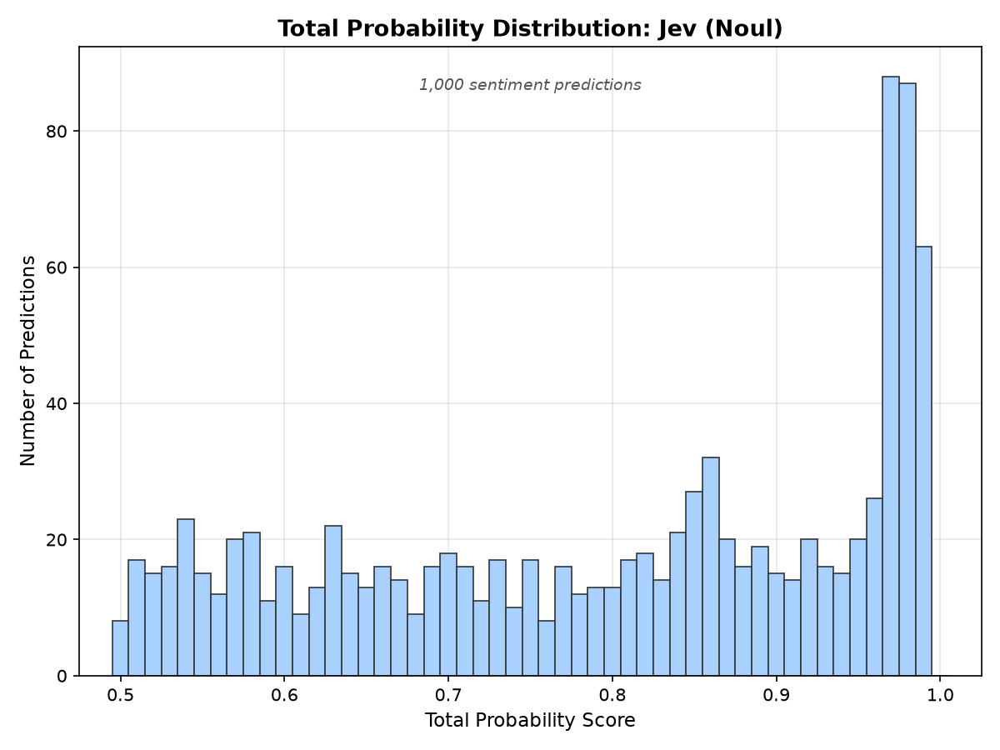
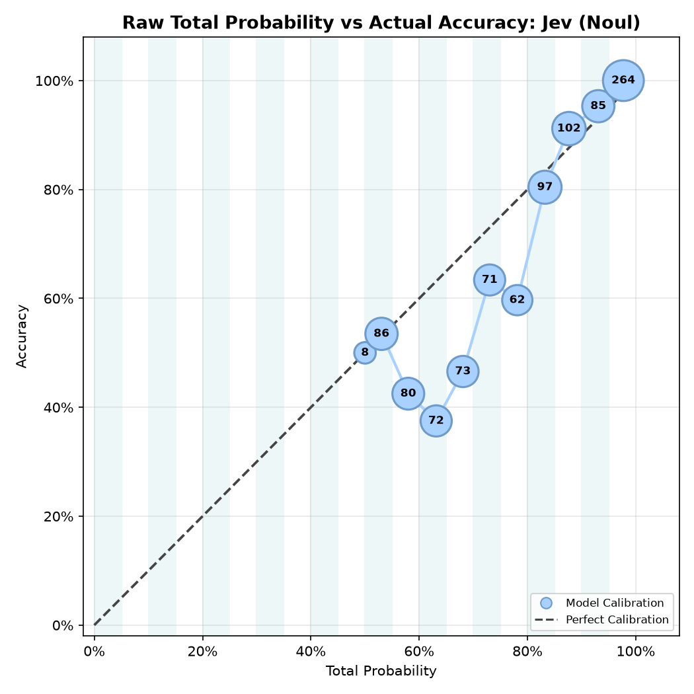
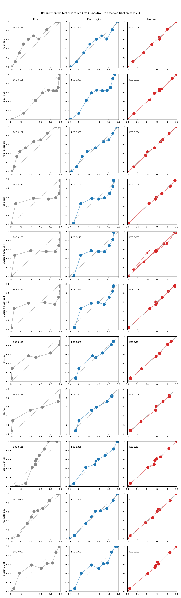
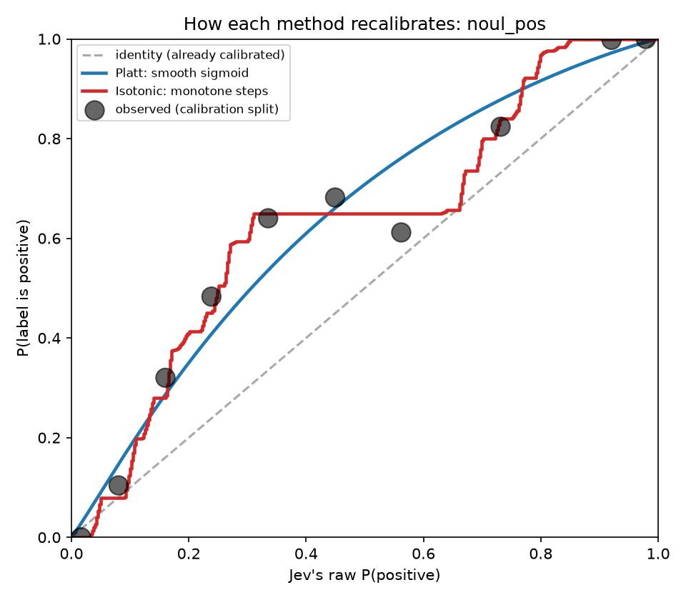
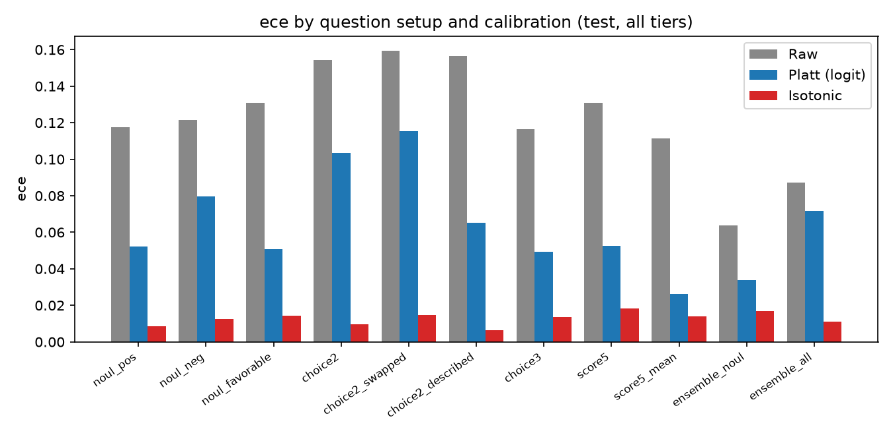
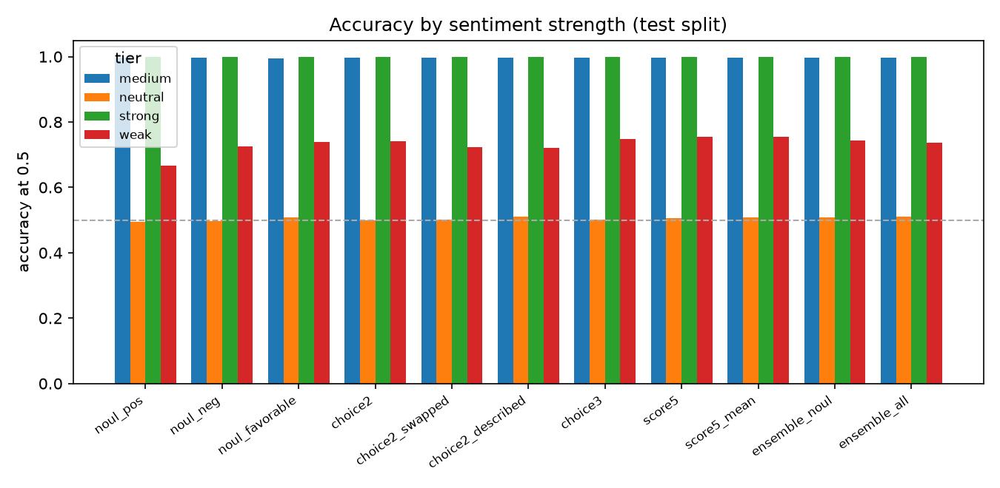
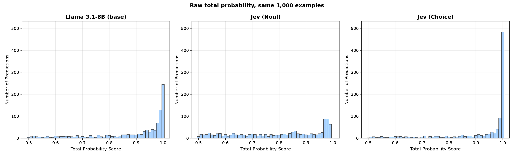
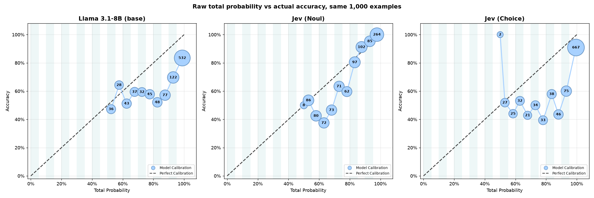
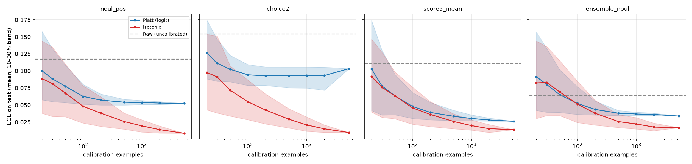
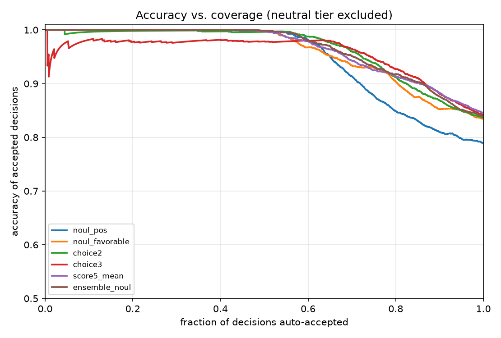

# Getting Calibrated Confidence from Jev

> **TL;DR**: Jev returns a probability with every answer, and how strongly it favors an answer is its *confidence*. That confidence is only useful if it matches reality: when Jev is 90% sure, it should be right about 90% of the time. On 8,801 labeled sentiment examples, Jev's raw probabilities didn't do that (expected calibration error 0.117). A two-parameter Platt curve cut that to 0.052. **Isotonic regression cut it to 0.008**, because the miscalibration wasn't sigmoid-shaped. It beat Platt even with only 20–100 calibration examples, and once calibrated, the way you phrase the question matters much less than you'd expect.

This is the follow-up to [Making Decisions Instead of Generating Text](https://anth.us/blog/making-decisions-instead-of-generating-text/), which ended with "test calibration against a held-out set." It reuses the dataset and calibration ideas from [Classification-with-Confidence](https://github.com/AnthusAI/Classification-with-Confidence), where we squeezed confidence out of a local LLM's token log-probabilities. Here the model hands us the probabilities directly.

## Accuracy, confidence, and calibration

Three ideas run through everything below:

- **Accuracy** is measured: the share of predictions that agreed with the ground-truth labels, over some set of examples.
- **Confidence** belongs to a single prediction: how strongly the model favors the answer it gave, meaning the probability it assigns to that answer. A Noul answer of 0.80 is 80% confident in "yes"; a Noul answer of 0.20 is 80% confident in "no". Confidence says nothing on its own about whether the answer is right.
- **Calibration** is how well the two line up: among predictions made with about 90% confidence, is accuracy about 90%? A reliability diagram plots one against the other, and expected calibration error (ECE) is the average gap between them. A model can be accurate but poorly calibrated, or well calibrated but not very accurate.

Throughout, "confidence" means the top-label probability. Jev's API also returns a field named `confidence`, which is a different statistic, described below, and we refer to it as "the `confidence` field".

We calibrate two related quantities. In the question-variant experiments it's P(positive) against whether the label is positive. In the Llama comparison and the accuracy-vs-coverage charts it's the confidence in the predicted answer against whether that answer was correct. Their ECEs measure different things, so a model's number in one isn't comparable to its number in the other (for example, `noul_pos` scores 0.117 as P(positive) on the full test split and 0.073 as confidence in the predicted answer on the 1,000-example comparison sample).

## What Jev gives you

[Jev](https://typesafe.ai/blog/introducing-system-one-models-and-jev) accepts some text ("state") and a set of typed questions, and returns a typed answer to each:

| Question | Answer | Probability information |
|---|---|---|
| **Noul** | yes/no | `noul` = P(yes) |
| **Choice** | one of your options | `probabilities` per option, plus `confidence` |
| **Score** | a rating on your rubric | `probabilities` per level, an expected `score`, plus `confidence` |

Three things we observed on `jev-1.13.0`:

1. **Probabilities are rounded to two decimals**, so many answers tie at exactly 0.00 or 1.00. That matters for calibration.
2. **For a two-option Choice, the `confidence` field is `2·p_top − 1`** (to within rounding). For example, a top probability of 0.72 comes with a `confidence` of 0.45. It measures how peaked the distribution is, not the probability that the answer is right, so it isn't on the same scale as accuracy, and it carries no information beyond the top probability. The documentation calls it "a statistic computed from the probability distribution", so this isn't a surprise, but it means you can't get a second opinion from it on binary questions.
3. **It's cheap and fast.** About 330 input tokens per request (~$0.12 for the whole dataset at the published $42 per billion input tokens; output tokens are free), median latency 0.24 seconds, and no rate-limiting at concurrency 8.

## Do these numbers mean what they say?

If Jev says 80% positive, are 80% of such texts positive? We checked with the same 10,000-line sentiment set as the earlier project (strong / medium / weak / neutral × positive / negative). Exact repeats were dropped, leaving **8,801 unique examples**, split 60/40 (stratified, seed 42) into a **calibration** set (5,280) and an untouched **test** set (3,521).

Each example goes to Jev as **one request with several questions**. The first one is a Noul: *"Is the overall sentiment of this text positive?"*

Accuracy is very uneven across the tiers, and that is most of the story:

| Tier | Accuracy (`noul_pos`, test) |
|---|---|
| strong | 1.000 |
| medium | 0.997 |
| weak | 0.668 |
| neutral | 0.494 |

The `neutral_*` files carry deliberately arbitrary labels (a "domain bias" experiment from the original project), so ~50% there is the expected result, not a Jev failure. We report results with and without that tier.

### What the raw scores look like

The original project started by plotting the raw "total probability" (the probability of the predicted answer) for 1,000 random predictions. Here is the same view for Jev's Noul answers on the same 1,000 examples (its Llama 3.1-8B counterpart is in the comparison below):



Jev gives a wide spread rather than a single spike, with a bump around 97–99%. Then the check that matters: how accurate was each bucket?



Each dot is a 5% bucket, labeled with how many predictions landed in it. The top buckets (up to 100%) sit on or above the diagonal, the 264 predictions in the very top bucket were all correct, and the middle of the range (55–80%) falls *below* the diagonal: confident, but often wrong. Of the 358 predictions in the 55–80% range, 357 come from the weak and neutral tiers, and they account for all 181 errors there.

A **reliability diagram** groups predictions by predicted probability and plots the fraction that were actually positive. A calibrated model sits on the diagonal. Jev's raw probabilities don't:



Left column: raw. Jev is under-confident about positives in the middle of the range and its curve is bumpy. On the Choice variants it's worse: at a raw P(positive) of about 0.1, roughly 46% of the labels are positive.

## Two ways to fix it

Both learn a mapping from Jev's raw probability to observed frequency, fit on the calibration set only.

- **Platt scaling** fits a logistic curve: two parameters, smooth, works with little data.
- **Isotonic regression** learns any *monotone* (never-decreasing) step function: more flexible, needs more data.



The dots are what actually happened. There's a plateau: for raw scores from about 0.33 to 0.62, the true positive rate sits near 65%. A sigmoid can't bend that way. It splits the difference and stays off the data at both ends. Isotonic follows the data.

Held-out results for the `noul_pos` question (test split, lower is better):

| | ECE | MCE | Brier | Log loss |
|---|---|---|---|---|
| Raw Jev | 0.117 | 0.265 | 0.162 | 0.467 |
| + Platt | 0.052 | 0.134 | 0.143 | 0.420 |
| + Isotonic | **0.008** | **0.068** | **0.138** | **0.401** |

ECE is the average gap between predicted probability and observed frequency. Neither method changes *which* answers rank above others (Platt can't, and isotonic only adds ties), so accuracy and AUC barely move (0.872 → 0.874). Calibration makes the number trustworthy; it doesn't make Jev smarter.

This held for every question setup we tried:



Raw ECE ranged from 0.064 to 0.160 across setups, Platt from 0.026 to 0.115, and **isotonic from 0.006 to 0.018**.

## Does the way you ask matter?

We sent a panel of alternative setups for the same question, all in one request per example (`jev_calibration/variants.py`):

- `noul_pos` / `noul_neg`: ask "is it positive?" vs "is it negative?"
- `noul_favorable`: different wording
- `choice2`, `choice2_swapped`, `choice2_described`: a two-way Choice, reversed option order, and options with descriptions
- `choice3`: adds a `neutral` option
- `score5` / `score5_mean`: a five-level rubric, using the level probabilities or the expected score
- `ensemble_noul` / `ensemble_all`: averages across framings

What we found:

- **Raw calibration depends a lot on the setup, isotonic-calibrated quality much less.** After isotonic, Brier scores land in a narrow 0.135–0.158 band; a floor set largely by the arbitrary neutral labels.
- **Ranking quality (AUC) differs a little:** `noul_favorable` 0.885 and `ensemble_noul` 0.883 lead; `noul_neg` 0.827 and `score5` 0.832 trail. The expected score from a Score (`score5_mean`, 0.874) beat treating its levels as a Choice (0.832).
- **Averaging framings gives the best *raw* calibration** (`ensemble_noul` ECE 0.064) but it still benefits from calibration.
- **Option order and request composition barely matter.** Reversing the Choice options changed accuracy by under a point. The same Noul asked inside a different request differed from the earlier answer by 0.0074 on average (max 0.19).
- **Full results:** [`results/variants.json`](results/variants.json). Charts: [`images/variants/`](images/variants/).



## Compared with Llama 3.1-8B

The earlier project extracted confidence from a local Llama 3.1-8B-Instruct's token log-probabilities. Its cached results for 1,000 examples ([`data/reference/`](data/reference/llama31_8b_base_results.json)) are all in this dataset, so we can put Jev and Llama on **identical examples**, scored identically: the probability of the predicted label, and whether it was right. Every calibrated number below uses repeated 5-fold cross-validation, so no calibrator is scored on data it was fit on.





| (1,000 examples) | Llama 3.1-8B | Jev (Noul) | Jev (Choice) |
|---|---|---|---|
| Accuracy | 0.722 | 0.743 | 0.776 |
| Mean raw confidence | 0.891 | 0.799 | 0.921 |
| **Raw ECE** | 0.169 | **0.073** | 0.147 |
| ECE after Platt (CV) | 0.048 | 0.051 | 0.074 |
| ECE after isotonic (CV) | 0.021 | 0.022 | 0.016 |
| Brier after isotonic (CV) | 0.177 | 0.139 | 0.131 |
| **AUROC** (do higher-confidence answers tend to be the correct ones?) | 0.719 | **0.828** | **0.828** |
| Predictions at ≥95% confidence | 532, 83.5% correct | 284, **100%** correct | 686, 89.7% correct |

Excluding the arbitrary-label neutral tier (794 examples): AUROC is 0.762 for Llama and 0.896 / 0.897 for Jev; at ≥95% confidence Llama has 455 predictions at 87.9%, Jev's Noul 284 at 100%, and its Choice 595 at 95.8%.

What this says:

- **Raw calibration differs by how you ask Jev.** Llama and Jev's Choice are both overconfident (mean confidence 0.89 and 0.92 against accuracy of 0.72 and 0.78). Jev's Noul is much closer.
- **Once calibrated with isotonic regression, all three reach about the same error (ECE ≈ 0.02).** Calibration can make a confidence score's stated level match observed accuracy for either kind of model.
- **What differs is how informative the confidence is.** Jev's confidence separates right from wrong answers clearly better (AUROC 0.83 vs 0.72), and its calibrated Brier score is lower (0.13–0.14 vs 0.18). Calibration fixes what the numbers mean; it can't add information the score doesn't contain. In practice, Jev's most confident answers are more trustworthy: its top Noul bucket was right every time, and Llama's top bucket was right 83.5% of the time.
- **A note on the old repo's isotonic numbers.** Its cached isotonic ECE is effectively zero because the calibrator was scored on the same 1,000 examples it was fit on. Under cross-validation Llama gets 0.021.

**What this comparison doesn't cover.** It uses the *base* Llama 3.1-8B: the fine-tuned model's per-example results weren't saved in that repo, so comparing it would mean retraining. It also doesn't include OpenAI models. Our earlier work found that the log-probabilities from some widely used hosted models were too concentrated to serve as a useful confidence, and that reasoning models often don't expose them at all (see [Making Decisions Instead of Generating Text](https://anth.us/blog/making-decisions-instead-of-generating-text/)), but we haven't re-run that here, so nothing in this repo makes a claim about them. Prompts also differ between the systems, so treat the comparison as "same data, different systems", not a controlled test of the models.

## How much calibration data do you need?

The usual advice is that isotonic regression is data-hungry and Platt scaling is the safe choice for small calibration sets. We tested that directly: draw *n* labeled examples at random from the calibration split (200 times for each *n*), fit each method, and score it on the same fixed test split.



Lines are mean ECE; bands span the 10th–90th percentile across draws; the dashed line is uncalibrated Jev. Mean ECE for `noul_pos`:

| Calibration examples | 20 | 50 | 100 | 200 | 500 | 1,000 | 5,280 |
|---|---|---|---|---|---|---|---|
| Platt | 0.100 | 0.077 | 0.063 | 0.057 | 0.054 | 0.053 | 0.052 |
| Isotonic | 0.089 | 0.067 | 0.048 | 0.038 | 0.026 | 0.019 | 0.008 |

- **The advice didn't hold here.** Isotonic matched or beat Platt on average at every size we tried, down to 20 examples. In `score5_mean` and `ensemble_noul` the two are indistinguishable below about 50 examples, and isotonic pulls ahead from 100 on.
- **Platt stops improving early.** By about 200 examples its error has flattened, because its shape is wrong for this data, not because it lacks examples. Isotonic keeps improving, and hadn't stopped at 5,280.
- **With very little data, both are noisy.** At 20–30 examples the bands overlap heavily and a single unlucky draw can be worse than not calibrating (the 90th-percentile error is above the raw error).
- **Already-decent scores need more data before calibrating pays off.** `ensemble_noul` starts with the lowest raw error (0.064). Neither method beat it on average until roughly 100 calibration examples.

A practical reading: a few hundred labeled examples is enough to get most of the benefit, and isotonic is a reasonable default. Below ~50, treat a calibrator as a sanity check on direction, not a precise correction.

## Using calibrated confidence

The reason to calibrate is a routing policy: auto-accept what Jev is sure about, send the rest to a person. Ranking by calibrated confidence and accepting from the top:



On the non-neutral tiers, roughly the top half of decisions are accepted at 98–100% accuracy; beyond that accuracy decays. To keep accuracy at or above 95%, you could auto-accept about 65–74% of non-neutral decisions depending on the setup (about 49–52% if arbitrary-label neutral examples are included). The exact figures are in `results/variants.json`; they are sensitive to ties from Jev's rounding, so treat differences of a few points as noise.

Because calibrated confidence now tracks observed accuracy, "accept above 90% confidence" means the accepted answers are right about 90% of the time, and you can set different thresholds per question and per consequence.

## Limitations

- **One dataset, one model version, one run.** Sentiment on a constructed dataset says little about call-QA rubrics. Re-check on your own data.
- **We looked at the test split for many variants.** Picking a "best" setup from eleven candidates on the same test data is optimistic, and we haven't computed confidence intervals. The gap between Platt and isotonic is large enough to trust; the ordering among setups isn't.
- **The calibration-size experiment resamples one pool.** Every draw comes from the same 5,280 calibration examples and is scored on the same 3,521 test examples, so draws at large sizes overlap heavily and the bands understate the true variation. The calibration and test examples share a distribution; a calibration set from a different population would do worse.
- **Rounded probabilities and ties** limit resolution, and isotonic can only reproduce ~100 distinct levels.
- **Calibration is per question, per model version.** Refit when the question wording, data source, or model changes.
- **`confidence` for two-option questions adds nothing** over the probabilities. It may differ for Choices with more options; we didn't isolate that.

## Run it yourself

```bash
python3 -m venv .venv && .venv/bin/pip install -e ".[dev]"
cp .env.example .env                       # add TYPESAFE_API_KEY (console.typesafe.ai)
.venv/bin/python scripts/smoke.py          # 5 examples, prints raw responses
.venv/bin/python scripts/run_jev.py        # base run (resumable): data/jev_raw.jsonl
.venv/bin/python scripts/analyze.py        # top-label calibration: results/metrics.json
.venv/bin/python scripts/run_variants.py   # variant panel (resumable): data/jev_variants.jsonl
.venv/bin/python scripts/analyze_variants.py   # results/variants.json + images/variants/
.venv/bin/python scripts/calibration_size.py   # results/calibration_size.json (no API calls)
.venv/bin/python scripts/compare_llama.py      # Jev vs Llama 3.1-8B, histograms + reliability (no API calls)
.venv/bin/pytest                           # no API key needed
```

Raw Jev answers are committed under `data/`, so the analysis scripts reproduce every number and chart here without an API key.

## References

- [Making Decisions Instead of Generating Text](https://anth.us/blog/making-decisions-instead-of-generating-text/)
- [How to Make a Text Classifier Using an LLM](https://anth.us/blog/fine-tuned-classification-with-confidence/) and its [repository](https://github.com/AnthusAI/Classification-with-Confidence)
- [TypeSafe: Introducing System One Models & Jev](https://typesafe.ai/blog/introducing-system-one-models-and-jev), [Jev docs](https://docs.typesafe.ai/introduction), [Confidence](https://docs.typesafe.ai/confidence)
- [Platt scaling](https://en.wikipedia.org/wiki/Platt_scaling), [isotonic regression](https://scikit-learn.org/stable/modules/isotonic.html), [scikit-learn calibration guide](https://scikit-learn.org/stable/modules/calibration.html)
