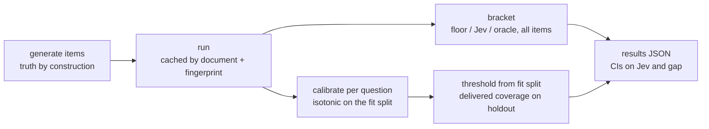

<h1 align="center">jev_eval</h1>

<p align="center">
  An evaluation scaffold for <a href="https://docs.typesafe.ai">Jev</a>, TypeSafe's System One model.<br>
  Built on the calibrators and metrics of <a href="https://github.com/AnthusAI/Jev-Calibration">AnthusAI/Jev-Calibration</a>.
</p>

<p align="center">
  <a href="#quick-start">Quick start</a> ·
  <a href="#the-protocol">Protocol</a> ·
  <a href="#modules">Modules</a> ·
  <a href="#the-four-demos">Demos</a> ·
  <a href="PREREGISTRATION.md">Pre-registration</a>
</p>

---

## Why this exists

Jev returns a typed answer and a probability in under half a second for a fraction of a cent. Two independent facts make evaluating it non-trivial:

| Fact | Source | Consequence |
|---|---|---|
| Raw probabilities rank well but are miscalibrated; ties are everywhere | [anth.us study](https://anth.us/blog/can-you-trust-jev-confidence/) | Any threshold must be set on **calibrated** probability, on a **holdout**, with tie-aware coverage |
| Wording is part of the model; the harness can do most of the work | [Jev jaggedness docs](https://docs.typesafe.ai/model-jaggedness/jev-1.13) | Report Jev **between a floor and an oracle**, and freeze wording **before** thresholds |

This package makes those rules mechanical so every demo gets the same honest measurement.

## Quick start

Everything runs offline with `--mock`, which swaps Jev for a noisy oracle. No API key needed.

```bash
.venv/bin/pytest -q                                              # upstream + scaffold tests
.venv/bin/python scripts/eval_extraction.py --mock               # demo 3, offline dry run
.venv/bin/python scripts/eval_reflex.py --mock --target-acc 0.85 # demo 4; at 0.95 the mock's noise leaves ~2% coverage
```

For a real run, put `TYPESAFE_API_KEY` in `.env` and drop `--mock`. Answers are cached in `data/eval_<task>.jsonl`, keyed by a hash of the document and a fingerprint of the exact question wording plus model id, so changing a document, a word or the model re-queries. Each run writes its own file under `results/eval/`, with n, seed, target, knobs and model in the name.

```bash
.venv/bin/python scripts/eval_extraction.py --n 500 --omit 0.25 --distractors 3
```

> Mock numbers are pipeline checks only. They say nothing about Jev.

## The protocol



<details>
<summary><b>Rank-based vs threshold-based use</b></summary>

Calibration does not change ranking. So:

- **Rank-based** decisions (top-k, argmax) run on raw probabilities. No labels needed.
- **Threshold-based** decisions (accept, reject, block, auto-approve) run on calibrated probability, per question, per primitive, per model id. Calibrator and threshold come from the fit split; the delivered coverage and accuracy at that threshold are reported from the holdout.

</details>

<details>
<summary><b>The floor is not just random</b></summary>

For per-question accuracy the floor is the better of uniform-random and majority-class guessing. A random floor alone flatters any question with many options, and a `not_stated`-heavy field would show a large gap for a model that only ever says `not_stated`. Guardrail rates use a coin-flip floor, because a majority floor there is "block everything". For tasks whose truth is by construction the oracle is 1 by definition; the floor is what carries the harness information. When the floor sits within 0.05 of the oracle the gap fraction is ill-conditioned and reported as null.

</details>

<details>
<summary><b>Why calibrators are never saved</b></summary>

They are recomputed each run from answers cached under the document hash and question fingerprint. A changed document, word, option or model id gives new answers and a new calibrator. There is no stale calibrator to load by mistake.

</details>

## Modules

| Module | What it does | Reuses upstream |
|---|---|---|
| `client` | Cached runner for any state + questions, keyed by document hash and fingerprint; refuses a served model that differs from the requested one; offline `MockJev` and a 2-decimal-rounding `noisy_oracle` | pattern of `jev_client.run` |
| `fingerprint` | Hash of wording, options, primitive and model id | |
| `calibration` | Stratified 60/40 split; isotonic and the accuracy-targeted threshold from the fit split; ECE, AUROC and delivered coverage from the holdout | `calibrate.Isotonic`, `calibrate.PlattLogit`, `metrics.summary`, `metrics.coverage_curve` |
| `bracket` | Floor / Jev / oracle points, 90% percentile-bootstrap CIs on Jev and on the gap fraction (non-finite resamples dropped), and a paired or unpaired difference | |
| `phrasing` | Paraphrase panel on both splits with exact McNemar; choose on the `cal_*` columns only | `calibrate.Isotonic`, `metrics.ece` |
| `counterfactual` | Sample of rejected items to review anyway; Wilson CI on the false-reject rate once review outcomes are entered | |
| `report` | Per-question evaluation and the shared task CLI | |
| `tasks/` | The four demo adapters | |

## The four demos

| # | Task | Truth comes from | Status |
|---|---|---|---|
| 3 | **Extraction** by synthetic inverse: a record rendered to a unique document, seven fields, every Choice has `not_stated`, no sentence leaks an unstated field's option | Construction | Runs end to end |
| 4 | **Reflex arc**: seeded tool-call traps, clean and injected twins kept on one side of the split, per-template destructive / out-of-scope labels, paired injected-minus-clean difference with CI | Construction (sandbox diff on real transcripts) | Runs end to end; 22 templates |
| 1 | **Tree pruning**: one Noul per branch on surface features, rank-based top-k, counterfactual expansion of pruned branches | Expanded outcomes | Schema and ranking only |
| 5 | **RTS**: units packed per request, named threat levels, batch planner under the published limits | Game outcome | Planner and schema only |

The planner's per-unit token costs are assumptions and the docs give no per-request question cap, so treat its output as a bound to verify. Under those assumptions 1,000 units at 5 Hz is not feasible; about 1,600 units at 1 Hz or 800 at 2 Hz is.

## What this is not

- Not a demo. No real Jev call has been made from this repository.
- Not an evaluation of Jev. It is the machinery for one.
- Not a fork that changes the upstream study. The `jev_calibration` package, its scripts, data and results are untouched. The root README gained a four-line banner, `pyproject.toml` registers this package, and `.gitignore` excludes eval caches.

## Provenance

Upstream code and data are by [Anthus](https://anth.us). Everything under `jev_eval/`, `evals/`, `tests/test_jev_eval.py` and the two `scripts/eval_*.py` files was written for this fork. The wording-selection step in the pre-registration has not been run yet, and no real Jev call has been made.
